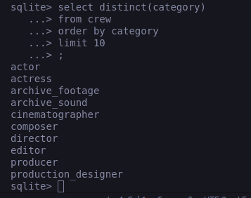
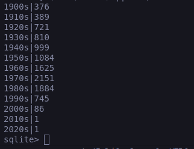

# Task 1

## Q1
sqlite> select distinct(category) from crew order by category limit 10;

## Q2
SELECT premiered, primary_title || ' (' || original_title || ')' FROM titles WHERE genres LIKE '%Action%' AND original_title != primary_title ORDER BY premiered DESC, primary_title LIMIT 10;

## Q3
SELECT primary_title, (CASE WHEN ended IS NULL THEN 2023 - premiered ELSE ended - premiered END) FROM titles WHERE type = 'tvSeries' AND premiered IS NOT NULL ORDER BY years_running DESC, primary_title LIMIT 20;

## Q4
SELECT (born/10 * 10) || 's', COUNT(DISTINCT p.person_id) from people p join crew c on p.person_id=c.person_id where c.category = 'director' and born >= 1900 group by (born/10*10) || 's' order by (born/10\*10) || 's';

## Q5
